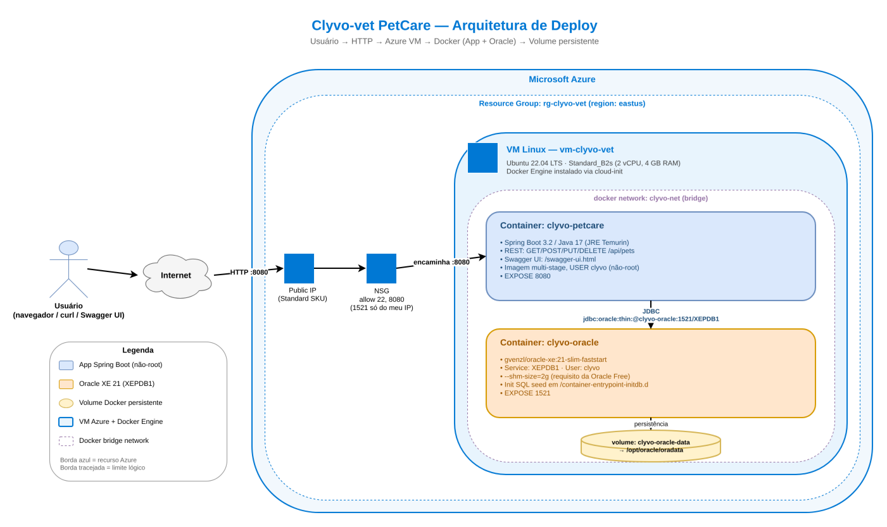

# Clyvo-vet — PetCare API

API REST de cadastro de pets (espécie, raça, idade, dono) para a clínica
**Clyvo-vet**. Stack Spring Boot 3 + Java 17 + Oracle XE 21, tudo em Docker,
com script Azure CLI que provisiona VM Linux e sobe a stack remota.

Repo: <https://github.com/MikW02/clyvo-vet-petcare>

## TL;DR — como rodar

```bash
git clone https://github.com/MikW02/clyvo-vet-petcare.git
cd clyvo-vet-petcare

# local (precisa Docker Desktop):
bash scripts/run-local.sh        # Linux/Mac/Git Bash
# ou:
powershell -ExecutionPolicy Bypass -File scripts/run-local.ps1

# Azure (precisa az login):
bash scripts/azure-deploy.sh
```

Todas as credenciais e configurações ficam em `.env` na raiz (já vem versionado
com senhas de demonstração). Edita lá se quiser mudar.

API depois de subir: <http://localhost:8080/swagger-ui.html>

---

## Arquitetura



Fluxo:

```
Usuário ──HTTP:8080──▶ Public IP ─▶ NSG ─▶ VM Linux (Ubuntu 22.04)
                                            └─ docker network "clyvo-net"
                                               ├─ clyvo-petcare  (Spring Boot, USER clyvo, non-root)
                                               └─ clyvo-oracle   (Oracle XE 21) ──▶ volume "clyvo-oracle-data"
```

- **API → DB:** JDBC interno em `clyvo-oracle:1521/XEPDB1` (não passa pela rede da VM).
- **Externo → API:** porta `8080` aberta no NSG.
- **Externo → DB:** porta `1521` aberta **só pro IP de quem rodou o deploy** (override `OPEN_DB=all` se quiser liberar).

---

## Mapeamento da rubrica

| Item                                            | Pts | Onde está atendido                                                         |
|-------------------------------------------------|-----|----------------------------------------------------------------------------|
| **Infra com Azure CLI**                         | 20  |                                                                            |
| ↳ Criar VM Linux                                |     | `scripts/azure-deploy.sh` linha do `az vm create` (Ubuntu 22.04 / B2s)     |
| ↳ Abrir portas necessárias                      |     | `az network nsg rule create` (22 default + 8080 app + 1521 DB)             |
| ↳ Instalar Docker                               |     | cloud-init no script (`docker-ce` via apt)                                 |
| ↳ Instalar ferramentas (git, nano, etc.)        |     | cloud-init: `packages: [git, nano, curl, ca-certificates, gnupg, jq]`      |
| **App + DB no Docker rodando na nuvem**         | 60  |                                                                            |
| ↳ Subir App + Banco em containers               |     | dois `docker run` no fim do `azure-deploy.sh`                              |
| ↳ Rodar em background (`-d`)                    |     | flag `-d` nos dois `docker run`                                            |
| ↳ Usuário sem ser root                          |     | `app/Dockerfile`: `groupadd --system clyvo` + `USER clyvo`                 |
| ↳ Volume nomeado                                |     | `-v clyvo-oracle-data:/opt/oracle/oradata` no run do Oracle                |
| ↳ Testar externamente (fora da VM)              |     | seção [Testes externos](#testes-externos) abaixo + screenshots em `docs/`  |
| **Arquitetura draw.io**                         | 20  | `docs/arquitetura.png` (renderizado a partir de fonte draw.io)             |

---

## Estrutura do repositório

```
challenge052026/
├── app/                              # Aplicação Spring Boot 3 / Java 17
│   ├── src/main/java/com/clyvovet/petcare/
│   │   ├── PetcareApplication.java
│   │   ├── model/Pet.java            # entidade JPA
│   │   ├── repository/PetRepository.java
│   │   ├── controller/PetController.java   # CRUD + documentação OpenAPI
│   │   ├── controller/HealthController.java
│   │   └── config/DataSeeder.java    # seed automático de 5 pets no startup
│   ├── src/main/resources/application.properties
│   ├── pom.xml
│   └── Dockerfile                    # multi-stage, USER clyvo (não-root)
├── oracle/
│   ├── Dockerfile                    # gvenzl/oracle-xe:21-slim-faststart
│   └── init/01_schema.sql            # cria tabela PETS (idempotente)
├── scripts/
│   ├── run-local.sh / .ps1           # sobe stack local com docker puro
│   ├── stop-local.sh
│   ├── azure-deploy.sh               # provisiona VM + sobe containers
│   └── azure-destroy.sh              # apaga TUDO no Azure
├── docs/
│   └── arquitetura.png
└── README.md
```

---

## Endpoints

Base URL: `http://<host>:8080`

| Método | Path                      | Status        | Descrição                            |
|--------|---------------------------|---------------|--------------------------------------|
| GET    | `/`                       | 200           | Banner JSON (liveness)               |
| GET    | `/api/pets`               | 200           | Lista todos                          |
| GET    | `/api/pets?species=dog`   | 200           | Filtra por espécie (case-insensitive)|
| GET    | `/api/pets/{id}`          | 200 / 404     | Busca por id                         |
| POST   | `/api/pets`               | 201 / 400     | Cadastra                             |
| PUT    | `/api/pets/{id}`          | 200 / 400 / 404 | Atualiza                            |
| DELETE | `/api/pets/{id}`          | 204 / 404     | Remove                               |

**Swagger UI:** http://`<host>`:8080/swagger-ui.html — documentação interativa de todos os endpoints com botão "Try it out".

**OpenAPI spec:** http://`<host>`:8080/v3/api-docs

Exemplo de payload:

```json
{
  "name": "Thor",
  "species": "dog",
  "breed": "Husky",
  "age": 3,
  "ownerName": "Carla Mendes"
}
```

Significado dos status codes:

- `201 Created` → POST criou; vem com header `Location: /api/pets/{id}`
- `204 No Content` → DELETE deu certo; corpo vazio
- `400 Bad Request` → payload falhou validação (nome em branco, idade negativa, etc.)
- `404 Not Found` → id inexistente

---

## Setup local (Docker)

**Pré-req:** Docker Desktop rodando, ~4 GB RAM livres.

### 0. Senhas e configuração

Tudo (senhas, REPO_URL, região Azure) está em `.env` na raiz, lido
automaticamente pelos scripts. As senhas atuais são de demonstração — troque
em `.env` antes de qualquer uso real:

```env
ORACLE_PASSWORD=FiapClyvo
APP_USER=clyvo
APP_USER_PASSWORD=FiapClyvo
DB_PASSWORD=FiapClyvo
REPO_URL=https://github.com/MikW02/clyvo-vet-petcare.git
LOCATION=eastus
```

### Linux / macOS / WSL

```bash
chmod +x scripts/*.sh
./scripts/run-local.sh
```

### Windows (PowerShell)

```powershell
powershell -ExecutionPolicy Bypass -File scripts\run-local.ps1
```

O script:

1. Cria network `clyvo-net` e volume `clyvo-oracle-data` (idempotente)
2. Builda `clyvo/oracle:local` e `clyvo/petcare:local`
3. Sobe `clyvo-oracle` em `-d` com `--shm-size=2g` e volume montado
4. Espera Oracle ficar healthy (~2 min no 1º boot)
5. Sobe `clyvo-petcare` em `-d` na mesma network, sem privilégios de root

### Testar (CRUD real no Oracle)

```bash
# listar (o DataSeeder coloca 5 pets toda vez que o app sobe)
curl http://localhost:8080/api/pets

# inserir
curl -X POST http://localhost:8080/api/pets \
     -H 'Content-Type: application/json' \
     -d '{"name":"Thor","species":"dog","breed":"Husky","age":3,"ownerName":"Carla"}'

# ler por id
curl http://localhost:8080/api/pets/1

# atualizar
curl -X PUT http://localhost:8080/api/pets/1 \
     -H 'Content-Type: application/json' \
     -d '{"name":"Rex","species":"dog","breed":"Labrador","age":5,"ownerName":"Maria"}'

# deletar
curl -X DELETE http://localhost:8080/api/pets/1
```

### Inspecionar o banco direto

```bash
docker exec -it clyvo-oracle sqlplus clyvo/$APP_USER_PASSWORD@//localhost:1521/XEPDB1
```

Por padrão o sqlplus quebra cada coluna numa linha. Cole esse snippet pra ver
em grid:

```sql
SET LINESIZE 200
SET PAGESIZE 50
COL ID         FORMAT 9999
COL NAME       FORMAT A12
COL SPECIES    FORMAT A8
COL BREED      FORMAT A12
COL AGE        FORMAT 999
COL OWNER_NAME FORMAT A18

SELECT * FROM PETS;
```

Saída esperada (depois do seed automático):

```
  ID NAME         SPECIES  BREED         AGE OWNER_NAME
---- ------------ -------- ------------ ---- ------------------
   1 Rex          dog      Labrador        4 Maria Silva
   2 Mia          cat      Siamese         3 Joao Souza
   3 Biscoito     rabbit                   2 Ana Lima
   4 Thor         dog      Husky           5 Carla Mendes
   5 Luna         cat      Persian         1 Pedro Rocha
```

Pra UI mais confortável: **DBeaver Community** → host `localhost`, port `1521`,
service name `XEPDB1`, user `clyvo`, password = a que você definiu em `.env`.

### Parar / limpar

```bash
./scripts/stop-local.sh           # para containers, mantém volume
./scripts/stop-local.sh --purge   # para tudo e apaga volume + network
```

---

## Deploy no Azure

**Pré-req:** `az` CLI instalado e logado (`az login`). Funciona em qualquer
assinatura com permissão de criar RG + VM (testado em Azure for Students).

```powershell
cd C:\caminho\pro\repo
bash scripts/azure-deploy.sh
```

> O script lê `.env` automaticamente. Pra override pontual:
> `$env:LOCATION = "westus2"; bash scripts/azure-deploy.sh`

> O script carrega `.env` automaticamente; se precisar override, exporte
> antes (`$env:ORACLE_PASSWORD = "..."`).

O que o script faz:

1. Cria resource group `rg-clyvo-vet`
2. Cria VM Ubuntu 22.04 (`Standard_B2s`) com cloud-init que instala
   `docker-ce`, `git`, `nano`, `curl`, `jq` e bota o admin user no grupo `docker`
3. Cria regras NSG: `8080` aberta pro mundo (app), `1521` aberta **só pro IP de quem rodou o deploy** (Oracle)
4. Espera cloud-init terminar (`cloud-init status --wait`)
5. Via `az vm run-command`: clona repo na VM, builda as 2 imagens, sobe `clyvo-oracle` (com `--shm-size=2g`), espera healthy, sobe `clyvo-petcare`, espera responder em `/api/pets`
6. Imprime IP público + comandos `curl` de exemplo

### Testes externos

Quando o deploy termina, ele dá o IP público. Do **seu computador** (fora da VM):

```bash
# Lista os 5 pets seed
curl http://<PUBLIC_IP>:8080/api/pets

# Cria um novo
curl -X POST http://<PUBLIC_IP>:8080/api/pets \
     -H 'Content-Type: application/json' \
     -d '{"name":"Luna","species":"cat","breed":"Persa","age":2,"ownerName":"Pedro"}'

# Abre o Swagger no navegador
start http://<PUBLIC_IP>:8080/swagger-ui.html
```

Screenshots de comprovação em `docs/screenshots/` (subir depois do primeiro deploy).

### Variáveis suportadas

| Variável             | Default                | O que é                                  |
|----------------------|------------------------|------------------------------------------|
| `RG_NAME`            | `rg-clyvo-vet`         | Resource Group                           |
| `LOCATION`           | `brazilsouth`          | Região Azure                             |
| `VM_NAME`            | `vm-clyvo-vet`         | Nome da VM                               |
| `VM_SIZE`            | `Standard_B2s`         | SKU (2 vCPU, 4 GB)                       |
| `ADMIN_USER`         | `clyvoadmin`           | Usuário Linux                            |
| `APP_PORT`           | `8080`                 | Porta exposta da API                     |
| `DB_PORT`            | `1521`                 | Porta exposta do Oracle                  |
| `ORACLE_PASSWORD`    | _(obrigatório)_        | Senha do `SYSTEM` no Oracle              |
| `APP_USER`           | `clyvo`                | Schema da aplicação                      |
| `APP_USER_PASSWORD`  | _(obrigatório)_        | Senha do schema                          |
| `REPO_URL`           | placeholder            | Repo Git que a VM vai clonar             |
| `OPEN_DB`            | (vazio)                | `all` libera 1521 pro mundo; default = só seu IP |

> **Senhas são obrigatórias** e nunca têm default no código. Defina em `.env` (ou exporte como env var antes de rodar). Nada vai pro git.

---

## Limpar Azure

Apaga **tudo** (VM, disco, NIC, IP, NSG, RG):

```bash
./scripts/azure-destroy.sh
```

ou direto:

```bash
az group delete --name rg-clyvo-vet --yes --no-wait
az group exists --name rg-clyvo-vet   # deve retornar "false"
```

---

## Configuração da aplicação

12-factor via env (defaults em `application.properties`):

| Env             | Default                                          |
|-----------------|--------------------------------------------------|
| `SERVER_PORT`   | `8080`                                           |
| `DB_URL`        | `jdbc:oracle:thin:@localhost:1521/XEPDB1`        |
| `DB_USER`       | `clyvo`                                          |
| `DB_PASSWORD`   | _(obrigatório, sem default)_                     |

`spring.jpa.hibernate.ddl-auto=update` → a tabela `PETS` é criada no 1º start
do app. Em todo restart, o `DataSeeder` (`config/DataSeeder.java`) limpa e
re-popula com 5 pets fixos pra UI ficar previsível em demos.
